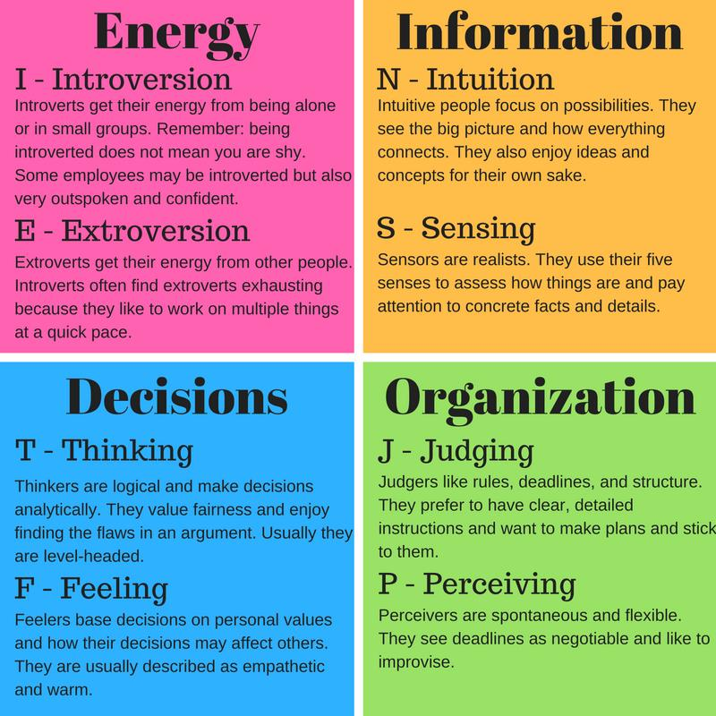

# Myers-Briggs-Personality-Test-The-Machine-Learning-Approach
According to the Myers & Briggs Foundation, there are 16 personality types created by Isabel Briggs and Katharine Cook Brigss on the work of Carl Jung based on four key dimensions that could be used to categorize people:

Introversion vs. Extraversion

Sensing vs. Intuition

Thinking vs. Feeling

Judging vs. Perceiving

ISTJ (The Inspector), ISFJ (The Nurturer), INFJ (The Counselor), INTJ (The Mastermind), ISTP (The Craftsman), ISFP (The Composer), INFP (The Idealist), INTP (The Thinker), ESTP (The Doer), ESFP (The Performer), ENFP (The Champion), ENTP (The Visionary), ESTJ (The Supervisor), ESFJ (The Provider), ENFJ (The Giver), ENTJ (The Commander).

